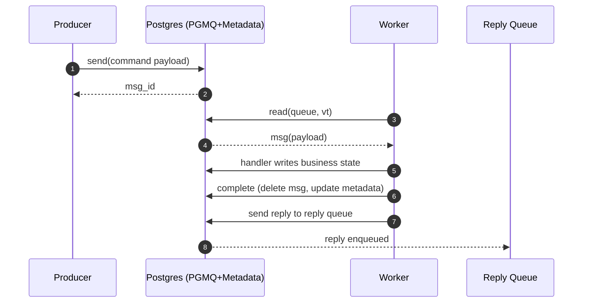
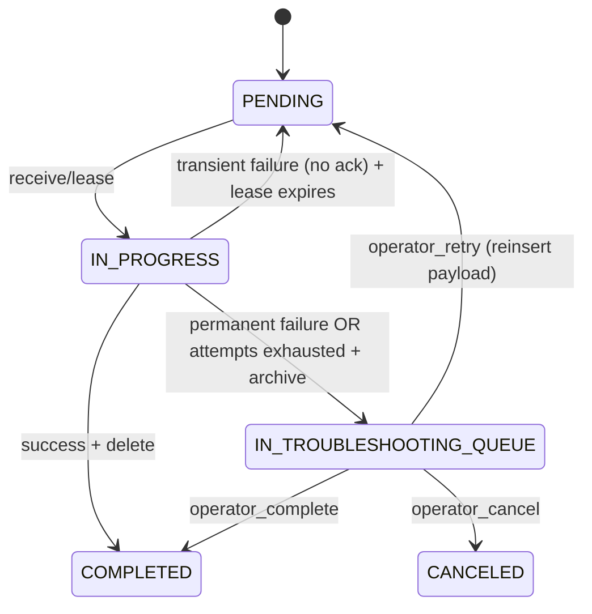

# 1. Goal

Build a **Python library** that provides a **Command Bus** abstraction on top of:

- **PostgreSQL** as the system of record for business data
- **PGMQ** as the durable queue for commands and replies (request/reply)
- Optional **LISTEN/NOTIFY** (via `pg_notify`) to reduce consumer polling latency

The library must prioritize **simplicity** while still providing:
- at-least-once delivery
- client-supplied **idempotent `command_id`**
- retries with backoff and exhaustion to **Troubleshooting Queue**
- operator actions: **retry / cancel / complete**
- searchable operational state (`command_id`, `status`, `type`, `domain`)
- audit trail (state transitions)
- a handler subscription model for workers

Domains use **one queue per domain** (e.g., `payments.commands`, `reports.commands`, `platform.commands`, `approvals.commands`) and a corresponding reply queue (e.g., `payments.replies`, etc.), or a shared reply queue (configurable).

---

# 2. Terminology (Ubiquitous Language)

**Command Bus** operations (library API):
- `send()` — enqueue a command
- `receive()` — lease a command message for processing
- `complete()` — acknowledge success (terminal)
- `cancel()` — acknowledge cancellation (terminal)
- `retry()` — *operator-initiated* reinsert from Troubleshooting Queue (terminal → active)
- (implicit retry) — when a worker fails transiently and does not ack, message becomes visible after lease expiry

**Troubleshooting Queue**:
- Not a separate broker queue by default.
- A **command status** plus archived payload and audit events.
- Normal workers do not process commands in troubleshooting state.

---

# 3. Non-Goals (v1)

- Exactly-once semantics across external systems (we provide at-least-once + idempotency hooks)
- Distributed transactions across multiple Postgres instances
- Complex ordering guarantees beyond “best-effort FIFO”
- Dynamic per-aggregate ordering / sharding keys (can be added later)

---

# 4. Core Semantics

## 4.1 Delivery Model

- **At-least-once** delivery.
- Workers call `receive(vt)` which leases a message using PGMQ visibility timeout.
- If the worker does not ack (complete/cancel/archive), the message becomes visible again after `vt`.

## 4.2 Idempotency

- `command_id` is **client-supplied** and mandatory.
- `send()` must enforce **unique `command_id` per domain** (configurable: global uniqueness vs per-domain).

## 4.3 Retry Policy

Two failure classes, via exceptions:

- `PermanentCommandError`  
  - **max_attempts = 1**
  - on failure → move to Troubleshooting Queue immediately

- `TransientCommandError`  
  - default `max_attempts = 3` (configurable per command type)
  - backoff schedule default: `10s, 60s, 300s` (configurable)
  - on exhaustion → move to Troubleshooting Queue

Other exceptions are treated as `TransientCommandError` by default (configurable mapping).

**Important:** transient retries do **not** delete and re-add. They rely on lease expiry.

## 4.4 Terminal States & Replies

Terminal states:
- `COMPLETED` → publish one reply message (`SUCCESS`)
- `CANCELED` → publish one reply message (`CANCELED`)
- `IN_TROUBLESHOOTING_QUEUE` → **no reply automatically** (reply occurs when operator resolves)

Operator resolutions:
- `retry` → reinsert same payload (new msg_id), status back to `PENDING`
- `cancel` → terminal + reply
- `complete` → terminal + reply

---

# 5. Data Model (Searchable; Avoid JSONB Search)

PGMQ body remains JSON, but operational/searchable fields live in relational tables.

## 5.1 Command Metadata Table (owned by library)

```sql
create table command_bus_command (
  domain            text not null,
  queue_name        text not null,
  msg_id            bigint null,
  command_id        uuid not null,
  command_type      text not null,
  status            text not null,
  attempts          int not null default 0,
  max_attempts      int not null,
  lease_expires_at  timestamptz null,
  last_error_type   text null,
  last_error_code   text null,
  last_error_msg    text null,
  created_at        timestamptz not null default now(),
  updated_at        timestamptz not null default now(),
  reply_queue       text not null,
  correlation_id    uuid not null
);

create unique index uq_command_bus_command_domain_cmdid
  on command_bus_command(domain, command_id);

create index ix_command_bus_command_status_type
  on command_bus_command(status, command_type);

create index ix_command_bus_command_updated
  on command_bus_command(updated_at);
```

Notes:
- `msg_id` can change if operator retries (new PGMQ message). Keep it updated.
- `lease_expires_at` is informational only.

## 5.2 Command Audit Table (append-only)

```sql
create table command_bus_audit (
  audit_id      bigserial primary key,
  domain        text not null,
  command_id    uuid not null,
  event_type    text not null,
  ts            timestamptz not null default now(),
  details_json  jsonb null
);

create index ix_command_bus_audit_cmdid_ts on command_bus_audit(command_id, ts);
```

## 5.3 Optional Payload Archive

Default recommendation: use `pgmq.archive()` for troubleshooting/cancel so payload is retained in PGMQ archive tables.

If you need retention independent of PGMQ archives, add:

```sql
create table command_bus_payload_archive (
  domain        text not null,
  command_id    uuid not null,
  payload_json  jsonb not null,
  archived_at   timestamptz not null default now(),
  primary key(domain, command_id)
);
```

---

# 6. Messaging Topology

Per-domain:
- Commands queue: `<domain>.commands`
- Replies queue: `<domain>.replies`

If PGMQ queue naming cannot contain dots, apply a canonical transform, e.g.
- `payments.commands` → `payments__commands`

---

# 7. Envelope Formats (No Headers)

## 7.1 Command body

```json
{
  "command_id": "uuid",
  "type": "DebitAccount",
  "domain": "payments",
  "correlation_id": "uuid",
  "reply_to": "payments.replies",
  "created_at": "ISO-8601",
  "data": {"...": "..."}
}
```

## 7.2 Reply body

```json
{
  "command_id": "uuid",
  "correlation_id": "uuid",
  "domain": "payments",
  "type": "DebitAccountResponse",
  "outcome": "SUCCESS|CANCELED|FAILED",
  "completed_at": "ISO-8601",
  "data": {},
  "error": {"code": "...", "message": "...", "class": "..."}
}
```

---

# 8. Library Architecture

## 8.1 Package Layout

```
commandbus/
  api.py
  models.py
  policies.py
  handler.py
  worker.py
  repositories/
    base.py
    postgres.py
  pgmq/
    client.py
    notify.py
  ops/
    troubleshooting.py
  testing/
    fakes.py
```

## 8.2 Public API

### CommandBus

- `send(domain, command_type, command_id, data, reply_to=None, correlation_id=None) -> command_id`
- `register_handler(domain, command_type, handler_fn, retry_policy=None)`
- `run_worker(domain, *, concurrency=10, vt_seconds=30, use_notify=True)`
- `stop()`

### Operator API

- `list_troubleshooting(domain, *, type=None, limit=100)`
- `operator_retry(domain, command_id)`
- `operator_cancel(domain, command_id, reason)`
- `operator_complete(domain, command_id, result_data=None)`

## 8.3 Exceptions

- `TransientCommandError(code, message, details=None)`
- `PermanentCommandError(code, message, details=None)`

---

# 9. PGMQ Usage (Correctness)

## 9.1 Send (transactional)

Within one DB transaction:
1. Insert metadata row (enforce uniqueness)
2. `pgmq.send(queue, payload_json)` → `msg_id`
3. Update metadata `msg_id`
4. Insert audit event `SENT`
5. `pg_notify('commandbus.<domain>', '<queue>')` (optional)

## 9.2 Receive (lease)

- `pgmq.read(queue, vt, qty)` to lease messages.
- For each message:
  - Parse payload → `command_id`, `type`
  - Lookup metadata by `(domain, command_id)`
  - If terminal/troubleshooting: archive message and continue
  - Update metadata (attempts++, optional `IN_PROGRESS`)
  - Audit `RECEIVED`
  - Dispatch handler

## 9.3 Complete / Cancel (transactional)

- Update business data (handler)
- `pgmq.delete(queue, msg_id)` on complete
- `pgmq.archive(queue, msg_id)` on cancel
- Update metadata to terminal status
- Publish reply to reply queue via `pgmq.send`
- Audit events

## 9.4 Move to Troubleshooting Queue

On permanent failure or attempts exhausted:
- `pgmq.archive(queue, msg_id)`
- metadata `IN_TROUBLESHOOTING_QUEUE`
- audit `MOVED_TO_TROUBLESHOOTING_QUEUE`

## 9.5 Operator Retry

- Read archived payload (from PGMQ archive or payload archive table)
- Reinsert same payload via `pgmq.send` (new msg_id)
- Reset metadata to `PENDING`, attempts=0 (or configurable)
- audit `OPERATOR_RETRY`

---

# 10. pg_notify / LISTEN Optimization

- On send: `pg_notify('commandbus.<domain>', '<queue>')`
- Worker: `LISTEN commandbus.<domain>` and wake to drain
- Keep fallback polling (1–5s) for robustness

---

# 11. Concurrency

- `concurrency=N` is supported and accepted; ordering is best-effort.
- Prefer `asyncio` with async DB driver or thread pool with a pool.

---

# 12. Testing Strategy (95%+ coverage)

## 12.1 Unit tests (no Postgres)

- `FakePgmqClient` with vt simulation
- in-memory repositories
- verify:
  - idempotent send
  - handler dispatch
  - transient retry schedule
  - permanent failure → troubleshooting
  - operator retry/cancel/complete transitions

## 12.2 Integration tests (Postgres + PGMQ)

- docker-compose Postgres with pgmq extension
- verify:
  - send/read/delete/archive behavior
  - metadata/audit writes
  - notify/listen wake path (separate test)

## 12.3 End-to-end tests

- producer + worker + reply consumer
- scenarios:
  1. happy path
  2. transient fail twice then success
  3. permanent fail → troubleshooting (no reply until operator)
  4. exhausted retries → troubleshooting
  5. operator retry → success
  6. operator cancel → canceled reply
  7. duplicate send → one processing

---

# 13. Claude Code Implementation Checklist

1. Bootstrap package + config
2. Implement `PgmqClient` SQL wrapper
3. Implement Postgres repositories + migrations
4. Implement CommandBus send/receive/complete/cancel
5. Implement handler registry + worker loop + concurrency
6. Implement notify/listen wake path + fallback poll
7. Implement operator troubleshooting APIs
8. Implement unit tests with fakes (coverage gate)
9. Implement integration + E2E tests with docker-compose
10. Write README and operational runbook

---

# 14. Mermaid Diagrams

## 14.1 Happy path



## 14.2 Retry + troubleshooting



---

# 15. Open Questions (confirm during implementation)

- PGMQ queue naming constraints (dots vs canonical transform)
- Archive retention strategy (how long to keep archives)
- Whether to mark `IN_PROGRESS` in metadata or keep `PENDING` until terminal (config flag)
- Whether to reset attempts on operator retry

---
